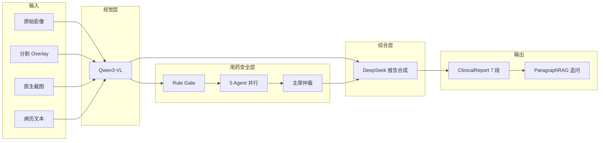

# 第六阶段汇报：视觉语言报告 + 段落 RAG 追问

> **阶段目标**：将分割 overlay、医生截图与病历文本融合，生成结构化临床报告，并支持段落级 RAG 追问。  
> **承接**：Stage 5 影像分割与截图采集。  
> **实验日期**：2026-06-21  
> **本报告版本**：v1

---

## 一、承接 Stage 5

Stage 5 产出 **原始影像 + 分割 overlay + 医生截图**。Stage 6 在此基础上构建 **Vision → Multi-Agent → Report** 流水线，把影像发现与 Stage 1~4 用药安全多智能体能力打通。

```
分割 overlay + 截图 + 病历摘要
  → Qwen3-VL 视觉分析
  → MultiAgentOrchestrator 用药审查
  → DeepSeek 报告综合 + 思维链
  → 7 段结构化 ClinicalReport
  → ParagraphRAG 医生追问
```

---

## 二、报告流水线架构



| 模块 | 文件 | 职责 |
|------|------|------|
| 报告生成 | `src/reports/report_generator.py` | 编排 VLM + 多 Agent + DeepSeek |
| 报告存储 | `src/reports/report_store.py` | JSON 持久化，同 session 原地更新 |
| 段落 RAG | `src/reports/paragraph_rag.py` | TF-IDF 段落检索 |
| 报告问答 | `src/reports/report_qa.py` | RAG + LLM 医生追问 |
| 视觉客户端 | `src/llm/vision_client.py` | Qwen3-VL + DeepSeek 合成 |

---

## 三、七段结构化报告

`ReportGenerator` 输出固定 7 段 `ReportParagraph`：

| section | 标题 | 主要来源 |
|---------|------|----------|
| `clinical_analysis` | 临床病症分析 | Qwen3-VL / DeepSeek |
| `imaging_findings` | 影像学发现 | Qwen3-VL |
| `medication_recommendation` | 用药推荐 | Qwen3-VL → 多 Agent |
| `pharmacy_assessment` | 药学专家评估 | clinical_pharmacist Agent |
| `allergy_analysis` | 过敏分析 | allergy_specialist Agent |
| `anesthesia_surgery` | 手术麻醉用药评估 | Qwen3-VL（围术期扩展位） |
| `risk_summary` | 综合风险与结论 | 主席仲裁 + DeepSeek |

报告同时保存 `chain_of_thought` 字段，记录 DeepSeek 综合推理链。

---

## 四、双 LLM 配置

`config.yaml` 新增两段独立 LLM 配置：

```yaml
vision_llm:
  provider: mock              # mock | qwen
  model: qwen-vl-max-latest   # Qwen3-VL 系列
  base_url: https://dashscope.aliyuncs.com/compatible-mode/v1

deepseek_llm:
  model: deepseek-chat        # DeepSeek V3
  base_url: https://api.deepseek.com/v1
```

| 客户端 | 环境变量 | Mock 行为 |
|--------|----------|-----------|
| Qwen3-VL | `MEDSAFE_VISION_LLM__API_KEY` | 返回固定 JSON 影像分析 |
| DeepSeek | `MEDSAFE_DEEPSEEK__API_KEY` | 返回模板化 7 段报告 |

**默认 mock 模式**：无 API Key 亦可完整跑通 Demo。

---

## 五、与 Stage 1~4 多智能体衔接

`ReportGenerator.generate()` 内部调用 `MultiAgentOrchestrator.run()`：

1. Qwen3-VL 从影像提取 `recommended_drugs` → `CandidateDrug[]`
2. 若无显式 `patient_context`，从 VLM 输出构造 `PatientContext`
3. 多 Agent 并行审查（`skip_clarify=True`，报告场景不做交互追问）
4. 规则引擎 `rule_output` 与 `agent_opinions` 一并注入 DeepSeek 合成

**设计原则**：规则引擎仍是 Layer 1 守门层，`rule_strict=true` 时 high 风险不可被 LLM 覆盖（沿用 Stage 3~4 语义）。

---

## 六、报告存储策略

`ReportStore` 按 **患者 + 影像 session** 组织：

```text
data/reports/{patient_id}/{report_id}.json
```

| 策略 | 说明 |
|------|------|
| Session 去重 | 相同 `imaging_session_id` → 原地更新，不堆叠版本 |
| Session ID | SHA256(影像路径 + 模态 + label) 前 16 位 |
| 补充问答 | `append_supplement()` 追加 Q&A 到 `supplements[]` |

示例：`data/reports/p10000764/rpt_e639ad122f85.json`

---

## 七、段落 RAG 追问

`ParagraphRAGIndex` 实现轻量段落检索（无需向量数据库）：

1. 中文 + 英文 TF-IDF 分词
2. 余弦相似度检索 Top-K 段落
3. 拼接历史 `supplements` 作为上下文
4. LLM 基于上下文回答，并写回报告

**API**：

| 接口 | 说明 |
|------|------|
| `POST /api/v1/imaging/report/generate` | 生成/更新报告 |
| `GET /api/v1/imaging/report/{patient_id}` | 患者报告列表 |
| `GET /api/v1/imaging/report/{patient_id}/{report_id}` | 单报告详情 |
| `POST /api/v1/imaging/report/ask` | 段落 RAG 追问 |

---

## 八、前端集成

`ImagingView.vue` Stage 6 扩展：

- **生成报告** — 传入 overlay + 截图 + 临床文本 → 展示 7 段报告
- **思维链折叠** — 展示 `chain_of_thought`
- **段落追问** — 输入问题 → 显示 RAG 回答 + 相关段落高亮

`frontend/src/api/medsafe.ts` 新增 `generateReport()`、`askReport()` 等封装。

---

## 九、Schema 扩展

`src/schemas.py` 新增：

- `ClinicalReport` / `ReportParagraph` / `ReportSupplement`
- `GenerateReportRequest` / `ReportAskRequest` / `ReportAskResponse`
- `ImagingStudyItem` / `SegmentRequest` / `SegmentResponse`

与 Stage 1 三类核心输出（Extraction / Review / Clarify）并列，报告为 **第四类持久化产物**。

---

## 十、联调要点

| 测试项 | 预期 |
|--------|------|
| Mock VLM 报告生成 | 200 + 7 段 paragraphs |
| 同 session 重复生成 | report_id 不变，updated_at 更新 |
| 段落追问 | supplements 追加 + related_paragraphs 非空 |
| 多 Agent 注入 | pharmacy / allergy 段含 Agent 意见 |

---

## 十一、已知限制

| 限制 | 说明 |
|------|------|
| VLM 依赖云端 | 真实 Qwen3-VL 需 DashScope API Key |
| RAG 为 TF-IDF | 非 Embedding 向量库，长报告检索精度有限 |
| 围术期段落 | `anesthesia_surgery` 为占位扩展，尚无独立 Agent |
| 报告与 Case Log 分离 | 报告存 `data/reports/`，Case 仍存 `data/cases/` |

---

## 十二、Stage 6 交付物

- [x] `ReportGenerator` 七段报告流水线
- [x] Qwen3-VL + DeepSeek 双客户端（含 Mock）
- [x] `ReportStore` session 级持久化
- [x] `ParagraphRAGIndex` + `ReportQAService`
- [x] 报告相关 FastAPI 路由（generate / list / get / ask）
- [x] 前端报告生成与追问 UI

---

## 十三、一句话总结

Stage 6 将 MedSafe 从「文本用药审查」升级为 **「影像 + 用药」联合报告系统**——Qwen3-VL 读图、多智能体审药、DeepSeek 综合成 7 段结构化报告，段落 RAG 支持医生持续追问。
