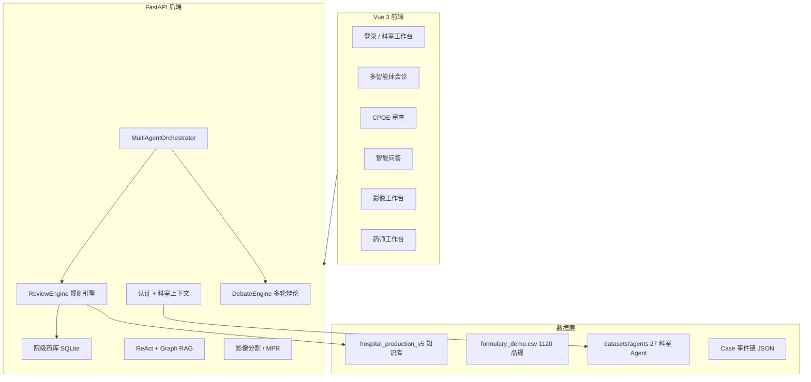

# MedSafe 多智能体用药安全审查系统 — 完整功能说明报告

> 基于当前代码库（`medince_agent`）整理，涵盖 **27 个临床科室**、**全部前端模块**、**后端 API** 与 **多智能体/规则/影像** 能力。  
> 最后更新：2026-06-23

---

## 一、项目定位

**MedSafe** 是一套面向医院场景的 **用药安全审查 + 多智能体会诊 + 智能问答 + 可选影像辅助** 系统，以 MIMIC-III 等真实临床数据为演示背景，核心进院链路为：

**院级药库（PIS CSV）→ CPOE 实时审查 → 确定性规则引擎 → 多轮辩论会诊 → 药师工作台 → 病例回放**

影像模块（分割、VLM 报告、MPR）为 **可选部署**，不影响用药安全主链路离线运行。

| 能力层级 | 无 API Key | 需 LLM/VLM Key |
|---------|-----------|----------------|
| 规则审查、CPOE 药库校验 | ✅ 可离线 | — |
| 多智能体会诊、Extract、辩论 | — | ✅ DeepSeek/OpenAI 等 |
| 智能问答 ReAct | — | ✅ Chat LLM |
| 影像视觉报告 | — | ✅ 通义 Qwen-VL |
| 报告综合合成 | — | ✅ DeepSeek |

> 系统 **禁止 Mock/假数据**：未配置真实 LLM 时接口返回 503（`LLMNotConfiguredError`），规则引擎与 CPOE 仍可正常工作。详见 `.cursor/rules/no-mock-data.mdc`。

---

## 二、系统架构总览



**会诊流水线**（`/consult`）：

```
病历输入 → LLM Extract 结构化
         → ReviewEngine 确定性规则（DDI / 重复成分 / 特殊人群 / 过敏）
         → 核心 Agent 并行初评（药师 / 内科 / 过敏 / 库管 + 科室 Agent）
         → Critic 对抗审查（2~3 轮）
         → Safety Panel 规则审计
         → Moderator 汇总 → 主席仲裁 → 追问/降级
         → Case JSON 持久化
```

多轮辩论架构详见 [DEBATE_ARCHITECTURE.md](./DEBATE_ARCHITECTURE.md)。

---

## 三、核心功能模块

### 3.1 院级药库与 CPOE 对接

| 功能 | 说明 |
|------|------|
| PIS CSV 导入 | 支持中英文表头，1120 行演示库 `datasets/hospital/formulary_demo.csv` |
| 术语映射 | RxNorm CUI、ATC、院内码 `hospital_drug_id` |
| 启动自动同步 | `config.yaml` → `drug_catalog.auto_import_on_startup: true` |
| CPOE 实时审查 | `POST /api/v1/cpoe/medication-review`，分级告警 `hard_stop / warning / info` |
| 药库搜索 | 模糊搜索、按院内码查询、统计接口 |

典型演示：华法林（`H-DEMO-00001`）+ 布洛芬（`H-DEMO-00006`）→ `blocked` + DDI 告警。

CSV 模板与同步命令见 [README.md](../README.md#院级药库与-cpoe-对接)。

### 3.2 确定性规则引擎（ReviewEngine）

规则类别：

| 类别 | 内容 |
|------|------|
| `drug_interaction` | 手写规则 + DrugBank/TWOSIDES 扩充 + Bio_ClinicalBERT DDI 补充层 |
| `duplicate_ingredient` | 重复成分检测（~449 条） |
| `special_population` | 妊娠/哺乳/老年/儿科/肝肾功能等人群禁忌 |
| `allergy` | 过敏史、交叉过敏 |

知识库当前指向 `datasets/knowledge/hospital_production_v5.json`（Stage 9 生产 KB，含 TWOSIDES 信号合并）。

辅助小模型（可选）：

| 模型 | 目录 | 用途 |
|------|------|------|
| Med7 | `models/med7/` | 英文病历药名 NER |
| Bio_ClinicalBERT DDI | `models/ddi_bert/` | 规则未命中时的 SMILES 级概率拦截 |
| PubChem SMILES 缓存 | `datasets/knowledge/smiles_cache.db` | 离线复用 SMILES |

### 3.3 多智能体会诊（Multi-Agent Consult）

**核心 Agent（默认启用）**：

| Agent ID | 名称 | 职责 |
|----------|------|------|
| `clinical_pharmacist` | 临床药师 | DDI、剂量、重复用药 |
| `internal_medicine` | 内科主治 | 适应证匹配、off-label、合并症 |
| `allergy_specialist` | 过敏专员 | 过敏史、交叉过敏、ADR |
| `pharmacy_inventory` | 药房库管 | Formulary、库存、替代方案 |
| `specialist` | 专科医生（条件激活） | 妊娠/抗凝/老年等特殊人群 |
| `chief_reviewer` | 会诊主席 | 冲突仲裁，高风险规则不可被 LLM 覆盖（`rule_strict`） |
| `coordinator` | 信息协调员 | 追问生成、保守降级 |

**辩论机制**：

- 最多 3 轮，置信度阈值 0.75（`config.yaml` → `debate`）
- Critic 检查：阻断分歧、风险分歧、低置信、规则遗漏
- Safety Panel 独立规则审计
- 前端展示轮次、耗时、共识状态

### 3.4 智能问答（/chat）

- **ReAct 循环** + MCP 工具服务（API 启动时自动拉起子进程 `python -m src.mcp.mcp_server`）
- **Graph RAG**：药品知识图谱检索
- **双角色**：`doctor`（医护专业模式）/ `patient`（患者大众模式）
- **四级降级**（L0~L3）：LLM/MCP 故障时可降级到明确标注的规则引擎路径，不伪装 LLM 输出

> 整合说明：原 yuan-agent 已并入 MedSafe「智能问答」模块。

### 3.5 药师工作台（Stage 9）

| 页面 | 功能 |
|------|------|
| `/pharmacy` | 待审查队列，按 `hard_stop / warning / info` 分组 |
| `/pharmacy/review/:id` | 单条审查详情与 Override |
| `/pharmacy/audit` | Override 审计日志 |

临床药学科室默认导航包含药师工作台，其他科室以会诊/药库/CPOE 为主。

### 3.6 病例管理与回放

- 每次会诊/CPOE 审查生成 **Case 事件链 JSON**（`datasets/cases/`）
- `/cases` 列表 + `/cases/:id` 逐步回放（Extract → Rule → Agent → Debate → 仲裁）
- Benchmark 用例：`datasets/benchmark/cases/`（覆盖 27 科室正负样本）

### 3.7 影像模块（可选）

**数据源**（`src/imaging/catalog.py`）：

| 来源 | 模态 | 目录 |
|------|------|------|
| MIMIC-CXR-JPG | 胸片 XR | `datasets/mimic_cxr/` |
| MIMIC CT | CT 切片 | `datasets/mimic/` |
| BraTS 2024 | 脑 MRI | `datasets/brats2024/` |
| KiTS19 | 肾 CT | `datasets/kits19/` |
| 胸部 CT 演示 | CT 体数据 | `datasets/chest_ct/` |

**分割模型**：

| 模型 | 用途 |
|------|------|
| CXR Lesion | 胸片病灶（opacity/pneumonia/effusion） |
| BraTS Tumor | 胶质瘤 WT/TC/ET 3D 分割 |
| VISTA3D | 交互式 3D 脑区分割 |
| TotalSegmentator | CT 全器官分割 |
| SAM2D / SAM-Med3D | 2D/3D 交互勾画 |

**报告能力**：

- VLM 生成 **7 段临床报告**（需 Qwen-VL Key）
- **段落 RAG 追问**：针对报告某段继续提问
- **3D MPR 浏览**：NIfTI 体数据切片 PNG

科室登录后按 `imaging_sources` / `default_models` 过滤可见 study 与默认模型。

### 3.8 认证与科室工作台

- JWT 登录，用户绑定 **科室（dept_id）**
- 科室决定：**可见导航**、**影像范围**、**自动启用的科室 Agent**、**默认检验上下文**
- `/department` 科室仪表盘：本科室描述、推荐数据集、Vision 模型说明
- `/settings`：Agent/Skill 开关、自定义 Skill 注入

科室元数据：`datasets/departments/catalog.json`  
科室审查配置：`src/department/context.py` + `datasets/departments/dept_review_configs.json`

---

## 四、前端页面一览

| 路由 | 功能 | 典型使用科室 |
|------|------|-------------|
| `/login` | 登录 | 全部 |
| `/` | 系统概览、健康状态 | 全部 |
| `/department` | 科室工作台 | 全部 |
| `/consult` | 多智能体会诊（Demo / 自然语言 / 结构化表单） | 临床科室 |
| `/chat` | 智能问答 | 全部 |
| `/rule-review` | 纯规则审查（无 LLM） | 全部 |
| `/cpoe` | CPOE 结构化医嘱审查 UI | 临床 / 药学 |
| `/drugs` | 院级药库搜索与详情 | 全部 |
| `/cases` | Case 历史 | 全部 |
| `/cases/:id` | 事件链回放 | 全部 |
| `/agents` | 智能体阵容说明 | 全部 |
| `/imaging` | 影像浏览、分割、报告、MPR | 有影像权限的科室 |
| `/pharmacy` | 药师工作台队列 | 临床药学 |
| `/pharmacy/review/:id` | 审查详情 | 临床药学 |
| `/pharmacy/audit` | Override 审计 | 临床药学 |
| `/settings` | 个人 Agent/Skill 配置 | 全部 |

---

## 五、全科室覆盖（27 科室）

系统通过 `datasets/departments/catalog.json` 定义 **27 个科室**，每个科室配置：

- 中文/英文名称与描述
- **用药审查重点**（`dept_review_configs` + 科室 Agent Skills）
- **核心 Formulary 药清单**（高频 INN）
- **默认检验上下文**（如 INR、eGFR、QTc）
- **影像数据源与默认分割模型**（如有）
- **专属 Department Agent**（26 个专科 Agent + 血液科共用肿瘤 Agent）

科室 Agent 注册见 `datasets/agents/registry.yaml`，Skill 正文见 `datasets/agents/{agent_id}/*.md`。

---

### 5.1 内科系统

#### 1. 呼吸内科（`respiratory`）

- **用药重点**：COPD/哮喘/肺炎抗感染、吸入治疗、茶碱交互
- **科室 Agent**：`respiratory_specialist` — COPD 管理、吸入治疗、呼吸抗感染
- **Skills**：`copd_management`, `inhaled_therapy`, `respiratory_antibiotic`
- **影像**：MIMIC-CXR；默认 `cxr_lesion`, `sam2d`
- **常见适应证**：COPD、哮喘、肺炎、肺栓塞

#### 2. 心血管内科（`cardiology`）

- **用药重点**：心衰多药联合、抗凝/抗血小板、抗心律失常
- **科室 Agent**：`cardiology_specialist` — 心衰、ACS 协议、抗凝桥接
- **Skills**：`heart_failure`, `acs_protocol`, `anticoag_bridge`
- **检验默认**：INR、eGFR、血钾、QTc、BNP
- **核心药品**：华法林/DOAC、β 阻滞剂、ACEI/ARB、胺碘酮、地高辛等
- **影像**：胸片（心影/肺水肿）、CT 心胸轮廓

#### 3. 消化内科（`gastroenterology`）

- **用药重点**：PPI/抗血小板、IBD 免疫抑制、肝代谢
- **科室 Agent**：`gastroenterology_specialist`
- **Skills**：`ppi_antiplatelet`, `ibd_immunosuppress`, `hepatic_metabolism`
- **检验默认**：ALT、AST、INR、eGFR
- **影像**：腹部 CT，`totalsegmentator`, `vista3d`

#### 4. 肾内科（`nephrology`）

- **用药重点**：肾剂量调整、高钾、透析用药、造影剂风险
- **科室 Agent**：`nephrology_specialist`
- **Skills**：`renal_dose_adjust`, `hyperkalemia_risk`, `dialysis_medication`
- **检验默认**：eGFR、血钾、血磷、iPTH
- **影像**：KiTS19 肾 CT、`totalsegmentator`

#### 5. 内分泌科（`endocrinology`）

- **用药重点**：糖尿病多药联合、甲状腺、激素替代
- **科室 Agent**：`endocrinology_specialist`
- **Skills**：`diabetes_combo`, `thyroid_ddi`, `steroid_management`
- **检验默认**：HbA1c、血糖、TSH、eGFR

#### 6. 血液内科（`hematology`）

- **用药重点**：抗凝/化疗骨髓抑制、出血风险
- **科室 Agent**：共用 `oncology_specialist`（化疗/免疫抑制场景）
- **检验默认**：INR、PLT、Hb、eGFR

#### 7. 风湿免疫科（`rheumatology`）

- **用药重点**：MTX 监测、生物制剂感染风险、NSAIDs GI 风险
- **科室 Agent**：`rheumatology_specialist`
- **Skills**：`mtx_monitoring`, `biologic_infection`, `nsaid_gi_risk`

#### 8. 感染科（`infectious_disease`）

- **用药重点**：抗感染谱系、耐药管理、HIV/TB/真菌 DDI
- **科室 Agent**：`infectious_disease_specialist`
- **Skills**：`antibiotic_spectrum`, `resistance_stewardship`, `hiv_tb_antifungal`
- **影像**：胸片肺炎/浸润影

#### 9. 老年科（`geriatrics`）

- **用药重点**：Beers 准则、跌倒风险、去处方化（Deprescribing）
- **科室 Agent**：`geriatrics_specialist`
- **Skills**：`beers_criteria`, `fall_risk`, `deprescribing`

#### 10. 普通内科（`general_internal`）

- **用药重点**：住院多病共存、慢病联合、off-label
- **科室 Agent**：`general_internal_specialist`
- **Skills**：`polypharmacy`, `chronic_disease_combo`, `comorbidity_risk`

---

### 5.2 外科系统

#### 11. 神经外科（`neurosurgery`）

- **用药重点**：颅脑围术期抗凝、颅内压、癫痫预防
- **科室 Agent**：`neurosurgery_specialist`
- **Skills**：`perioperative_anticoag`, `intracranial_htn`, `seizure_prophylaxis`
- **影像**：BraTS MRI，`brats_tumor`, `vista3d`

#### 12. 骨科（`orthopedic`）

- **用药重点**：围术期抗凝、NSAIDs 与骨愈合、VTE 预防
- **科室 Agent**：`orthopedic_specialist`
- **Skills**：`perioperative_anticoag`, `nsaid_bone_healing`, `vte_prophylaxis`

#### 13. 泌尿外科（`urology`）

- **用药重点**：α 阻滞剂低血压、BPH 与抗凝、结石镇痛
- **科室 Agent**：`urology_specialist`
- **Skills**：`alpha_blocker_hypotension`, `anticoag_prostate`, `renal_stone_analgesia`
- **影像**：KiTS19、`totalsegmentator`

#### 14. 麻醉科（`anesthesiology`）

- **用药重点**：麻醉诱导、围术期抗凝、恶性高热
- **科室 Agent**：`anesthesiology_specialist`
- **Skills**：`induction_agents`, `anticoag_periop`, `malignant_hyperthermia`

#### 15. 耳鼻喉科（`ent`）

- **用药重点**：耳毒性、气道用药、头颈围术期
- **科室 Agent**：`ent_specialist`
- **Skills**：`ototoxicity`, `airway_sedation`, `postop_analgesia`

---

### 5.3 专科系统

#### 16. 神经内科（`neurology`）

- **用药重点**：抗癫痫、帕金森、卒中二级预防
- **科室 Agent**：`neurology_specialist`
- **Skills**：`epilepsy_combo`, `parkinson_ddi`, `stroke_prevention`
- **影像**：BraTS 2024 MRI

#### 17. 肿瘤科（`oncology`）

- **用药重点**：化疗 DDI、免疫抑制、止吐联合
- **科室 Agent**：`oncology_specialist`
- **Skills**：`chemo_ddi`, `immunosuppress`, `antiemetic_combo`
- **影像**：BraTS + 胸片（肺转移/胸腔积液）

#### 18. 精神科（`psychiatry`）

- **用药重点**：五羟色胺综合征、QT 延长、精神药物 DDI
- **科室 Agent**：`psychiatry_specialist`
- **Skills**：`serotonergic_syndrome`, `qt_psychotropics`, `mood_stabilizer`
- **检验默认**：锂浓度、QTc、eGFR

#### 19. 皮肤科（`dermatology`）

- **用药重点**：系统免疫抑制、维 A 酸致畸、外用/全身叠加
- **科室 Agent**：`dermatology_specialist`
- **Skills**：`systemic_immunosuppress`, `retinoid_teratogenicity`, `topical_systemic`

#### 20. 眼科（`ophthalmology`）

- **用药重点**：眼毒性、青光眼局部/全身叠加
- **科室 Agent**：`ophthalmology_specialist`
- **Skills**：`ocular_toxicity`, `topical_beta_blocker`, `glaucoma_systemic`

#### 21. 康复医学科（`rehabilitation`）

- **用药重点**：卒中二级预防、痉挛管理、长期多重用药
- **科室 Agent**：`rehabilitation_specialist`
- **Skills**：`stroke_secondary_prevention`, `spasticity_mgmt`, `long_term_polypharmacy`

---

### 5.4 妇儿与特殊科室

#### 22. 妇产科（`obstetrics_gynecology`）

- **用药重点**：致畸、哺乳、宫缩剂
- **科室 Agent**：`obgyn_specialist`
- **Skills**：`teratogen`, `lactation_safety`, `tocolysis`
- **激活条件**：妊娠状态活跃

#### 23. 儿科（`pediatrics`）

- **用药重点**：体重/年龄剂量、生长影响、疫苗交互
- **科室 Agent**：`pediatrics_specialist`
- **Skills**：`pediatric_dosing`, `growth_impact`, `vaccine_interaction`
- **激活条件**：年龄 < 18 或科室 = pediatrics

---

### 5.5 急危重症与平台科室

#### 24. 急诊科（`emergency`）

- **用药重点**：急性中毒、复苏用药、急诊镇痛镇静
- **科室 Agent**：`emergency_specialist`
- **Skills**：`acute_toxicology`, `resuscitation_drugs`, `analgesia_sedation`
- **审查优先级**：DDI、过敏、特殊人群

#### 25. 重症医学科（`icu`）

- **用药重点**：血管活性药、镇静、CRRT 剂量调整
- **科室 Agent**：`icu_specialist`
- **Skills**：`vasoactive`, `sedation_protocol`, `crrt_adjustment`
- **检验默认**：eGFR、乳酸、INR、血钾、动脉血气

#### 26. 放射科（`radiology`）

- **用药重点**：造影剂安全、二甲双胍暂停、过敏预处理
- **科室 Agent**：`radiology_specialist`
- **Skills**：`contrast_safety`, `metformin_hold`, `allergy_premedication`
- **影像**：全模态工具箱（胸片、脑 MRI、CT 全器官、SAM2D）

#### 27. 临床药学（`pharmacy`）

- **用药重点**：高警示药品、全院 DDI、Formulary 一致性
- **科室 Agent**：`pharmacy_specialist`
- **Skills**：`high_alert_review`, `formulary_alignment`, `pharmacy_ddi`
- **专属导航**：`/pharmacy`, `/pharmacy/audit` + 会诊/CPOE/药库
- **无默认影像工作台**

---

## 六、智能体体系汇总

| 类型 | 数量 | 说明 |
|------|------|------|
| 核心 Agent | 7 | 药师、内科、过敏、库管、专科路由、主席、协调员 |
| 科室 Agent | 26 | 每科室 1 个（血液科共用肿瘤 Agent） |
| Skill 文件 | 100+ | `datasets/agents/{agent_id}/*.md` |
| 激活策略 | 规则驱动 | 科室 ID / 年龄 / 妊娠 / 药物关键词 |

科室 Agent 在会诊时由 `AgentRegistry.should_activate_department_agent()` 按科室上下文与患者信息自动注入辩论流程；用户可在 `/settings` 手动开关。

**核心 Agent Skills 一览**：

| Agent | 默认 Skills |
|-------|-------------|
| 临床药师 | `base`, `ddi_review`, `dose_review`（可选 `duplicate_review`） |
| 内科主治 | `base`, `indication_match`（可选 `comorbidity`） |
| 过敏专员 | `base`, `cross_allergy`（可选 `adr_history`） |
| 药房库管 | `base`, `formulary_check`（可选 `stock_alternative`） |
| 专科路由 | `base`, `pregnancy`, `anticoagulation`（可选 `geriatric`） |

---

## 七、后端 API 速查

### 用药安全与会诊

| 接口 | 说明 |
|------|------|
| `POST /api/v1/multi-consult` | 全流程会诊 |
| `POST /api/v1/multi-review` | 多智能体审查（跳过 Extract） |
| `POST /api/v1/extract` | LLM 结构化抽取 |
| `POST /api/v1/review` | 规则审查 |
| `POST /api/v1/clarify` | 追问 / 保守降级 |
| `GET /api/v1/cases` | Case 列表 |
| `GET /api/v1/case/{id}` | Case 回放 |

### 院级药库 / CPOE

| 接口 | 说明 |
|------|------|
| `POST /api/v1/cpoe/medication-review` | CPOE 结构化审查 |
| `POST /api/v1/drug-catalog/sync` | CSV 热同步 |
| `GET /api/v1/drug-catalog/stats` | 统计 |
| `GET /api/v1/drug-catalog/drugs/{id}` | 按院内码查询 |
| `GET /api/v1/drug-catalog/search?q=` | 模糊搜索 |

### 智能问答

| 接口 | 说明 |
|------|------|
| `POST /api/v1/chat/stream` | SSE 流式问答（`role`: `doctor` / `patient`） |
| `GET /api/v1/chat/system-state` | 降级状态 L0~L3 |
| `POST /api/v1/drug/info` | 药品图谱查询 |

### 影像与报告

| 接口 | 说明 |
|------|------|
| `GET /api/v1/imaging/studies` | Study 列表（科室过滤） |
| `POST /api/v1/imaging/segment` | 多模型串行分割 |
| `GET /api/v1/imaging/volume/meta` | NIfTI 体数据元信息 |
| `GET /api/v1/imaging/volume/slice` | MPR 切片 PNG |
| `POST /api/v1/imaging/report/generate` | 7 段视觉报告 |
| `POST /api/v1/imaging/report/ask` | 段落 RAG 追问 |

### 认证与药师

| 接口 | 说明 |
|------|------|
| `POST /api/v1/auth/login` | 登录 |
| `GET /api/v1/auth/me` | 科室工作台 + Agent 配置 |
| 药师队列/审查/Override | `/api/v1/pharmacy/*` |

完整 OpenAPI 文档：http://localhost:8000/docs

---

## 八、数据与 Benchmark

| 资源 | 路径 | 说明 |
|------|------|------|
| 科室目录 | `datasets/departments/catalog.json` | 27 科室元数据 |
| Agent 注册 | `datasets/agents/registry.yaml` | 核心 + 科室 Agent |
| 生产 KB | `datasets/knowledge/hospital_production_v5.json` | 规则 + KG |
| 演示药库 | `datasets/hospital/formulary_demo.csv` | 1120 品规 |
| Benchmark | `datasets/benchmark/cases/` | 各科室正负样本 |
| 病例模板 | `datasets/case_templates/` | 规则/科室测试输入 |
| Case 日志 | `datasets/cases/` | 会诊事件链持久化 |

Benchmark 命令：

```bash
source .venv/bin/activate
python scripts/run_benchmark.py --mode rule-only --dept all
python scripts/run_benchmark.py --mode cpoe --dept all
python scripts/run_benchmark.py --mode compare --kb-v1 expanded_mined_v1 --kb-v2 hospital_production_v4
python scripts/generate_stage9_validation_report.py
```

---

## 九、部署与启动

```bash
# 首次安装
bash scripts/setup.sh

# 启动 API (:8000) + 前端 (:5173)
bash scripts/start.sh

# 同步药库
python scripts/sync_formulary.py --csv datasets/hospital/formulary_demo.csv

# Docker（可选，不含影像权重）
docker compose up -d --build
```

| 地址 | 说明 |
|------|------|
| http://localhost:5173 | 前端 UI（开发模式） |
| http://localhost:8000/health | 健康检查 |
| http://localhost:8000/docs | API 文档 |

**环境变量要点**（详见 [README.md](../README.md#配置)）：

| 变量 | 用途 |
|------|------|
| `MEDSAFE_LLM__API_KEY` | 会诊 Extract / Agent |
| `MEDSAFE_CHAT__API_KEY` | 智能问答 |
| `MEDSAFE_VISION_LLM__API_KEY` | 影像 VLM |
| `MEDSAFE_DEEPSEEK__API_KEY` | 报告合成 |
| `MEDSAFE_AGENTS__RULE_STRICT` | 高风险规则不可覆盖（默认 true） |
| `MEDSAFE_DRUG_CATALOG__FORMULARY_PATH` | 院目录 CSV 路径 |

---

## 十、项目结构

```text
medince_agent/
├── frontend/              # Vue 3 + TypeScript + Vite
├── src/
│   ├── drug_catalog/      # 院目录 CSV 导入、术语、CPOE ReviewFacade
│   ├── agents/            # 多智能体（药师、内科、过敏、药房库管、专科、主席）
│   ├── department/        # 科室上下文与 Formulary 过滤
│   ├── debate/            # 多轮辩论 + Critic + Moderator + Safety Panel
│   ├── react/             # ReAct 循环 + 智能问答
│   ├── graph_rag/         # 药品知识图谱检索
│   ├── mcp/               # MCP 工具服务（子进程）
│   ├── auth/              # JWT 认证、科室工作台
│   ├── imaging/           # 影像目录、分割、MPR
│   ├── reports/           # 视觉报告 + 段落 RAG
│   ├── llm/               # LLM / VLM / Embedding 客户端
│   └── app.py             # FastAPI 入口
├── datasets/
│   ├── departments/       # 27 科室 catalog
│   ├── agents/            # Agent 注册与 Skill 正文
│   ├── hospital/          # formulary_demo.csv、formulary.db
│   ├── knowledge/         # 规则库 + drug_kg + SMILES 缓存
│   ├── benchmark/         # Benchmark 用例与报告
│   └── cases/             # Case 事件链
├── docs/                  # 架构文档与本报告
├── scripts/               # setup / start / sync / benchmark
├── config.yaml
└── docker-compose.yml
```

---

## 十一、能力边界说明

1. **用药安全主链路**已可离线演示（规则 + CPOE + 药库）；LLM 会诊/问答需真实 Key。
2. **27 科室**均有 Agent、Formulary 清单、Benchmark 用例与审查配置；知识库规则密度因科室而异（Stage 9 已从早期「少数科室可用」扩充至生产 KB v5，详见 [STAGE9_UPGRADE_PLAN.md](./STAGE9_UPGRADE_PLAN.md)）。
3. **影像**依赖本地数据与模型权重，Docker 默认不含；各科室 `recommended_datasets` 多为公开数据集指引，需自行下载。
4. 系统为 **研究/演示/试点** 性质，临床决策须由持证医师/药师最终确认。

---

## 十二、项目演进阶段

| 阶段 | 里程碑 | 报告 |
|------|--------|------|
| Stage 1 | 总体方案 | [STAGE1_REPORT_CSDN.md](../STAGE1_REPORT_CSDN.md) |
| Stage 2 | Extract 原型 | [STAGE2_REPORT_CSDN.md](../STAGE2_REPORT_CSDN.md) |
| Stage 3 | 规则引擎 review/clarify | [STAGE3_REPORT_CSDN.md](../STAGE3_REPORT_CSDN.md) |
| Stage 4 | 多智能体 + Vue + Docker | [STAGE4_REPORT_CSDN.md](../STAGE4_REPORT_CSDN.md) |
| Stage 5 | 临床 UI + 影像 2D 分割 | [STAGE5_REPORT_CSDN.md](../STAGE5_REPORT_CSDN.md) |
| Stage 6 | 视觉报告 + 段落 RAG | [STAGE6_REPORT_CSDN.md](../STAGE6_REPORT_CSDN.md) |
| Stage 7 | 3D MPR + VISTA3D Bundle | [STAGE7_REPORT_CSDN.md](../STAGE7_REPORT_CSDN.md) |
| Stage 8 | 院级药库 CSV + CPOE | [STAGE8_REPORT_CSDN.md](../STAGE8_REPORT_CSDN.md) |
| Stage 9 | 全内科 KB + TWOSIDES + 药师工作台 + Benchmark | [STAGE9_REPORT_CSDN.md](../STAGE9_REPORT_CSDN.md) · [验证报告](./STAGE9_VALIDATION_REPORT.md) |

---

## 相关文档

- [README.md](../README.md) — 快速开始与配置
- [DEBATE_ARCHITECTURE.md](./DEBATE_ARCHITECTURE.md) — 多轮辩论架构
- [STAGE9_UPGRADE_PLAN.md](./STAGE9_UPGRADE_PLAN.md) — Stage 9 升级方案
- [REFERENCES.md](./REFERENCES.md) — 参考文献
